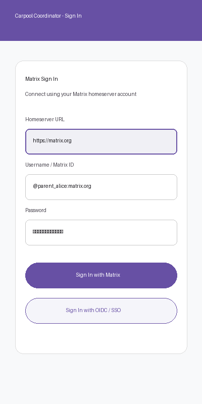
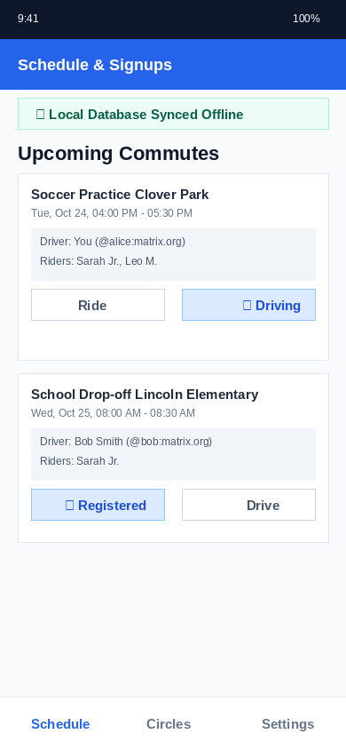
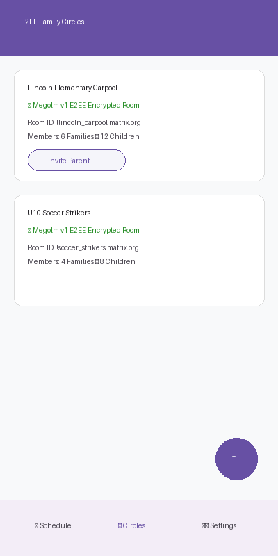
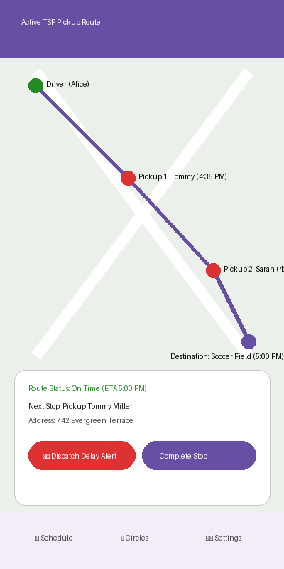

# Carpool Coordinator - Matrix Edition

An elegant, **fully decentralized, zero-cloud-cost**, offline-first solution for self-organized families, teams, and schools to coordinate carpooling, tracking, and schedules with absolute privacy using **Matrix**.

---

## 📸 Application Screenshots

| **Matrix Authentication & SSO** | **Schedule & Local Signups** |
| :---: | :---: |
|  |  |
| *Sign in with Matrix homeserver credentials or OIDC SSO* | *View synced iCal commutes, register to ride or drive* |

| **E2EE Family Circles** | **Active TSP Route & Dynamic Tracking** |
| :---: | :---: |
|  |  |
| *Manage Megolm v1 E2EE encrypted rooms & iCal feeds* | *TSP optimized waypoint pickup routes & delay alerts* |

---

## 🏗️ Recommended Expo App Templates & Architecture

If you are bootstrapping new projects or expanding this application, standard Expo starter templates provide an excellent foundation rather than starting completely from scratch:

* **`npx create-expo-app@latest --template tabs`** (Recommended)
  * Pre-configures Expo Router with TypeScript and file-based tab navigation under `app/(tabs)/`, matching the tab layout used in this repository (`schedule.tsx`, `circles.tsx`, `settings.tsx`).
* **`npx create-expo-app@latest --template blank-typescript`**
  * A lightweight Expo template with full TypeScript configuration pre-packaged.
* **`npx create-expo-app@latest -t expo-template-default`**
  * Includes standard Expo SDK utilities, vector icons (`@expo/vector-icons`), safe area context, and dark/light theme providers.

---

## ⚡ Quick Start Guide

### Prerequisites
* **Node.js**: v18.x or v20.x or v22.x (LTS)
* **npm**: v9+ or higher
* **Java Development Kit (JDK)**: JDK 17 (for local Android APK builds)
* **Android SDK / Android Studio**: (optional, required only for running on Android emulator or local native builds)

---

### 🚀 Getting Started in 3 Steps

#### 1. Clone the Repository & Install Dependencies
```bash
git clone https://github.com/carpool-coordinator/carpool-coordinator.git
cd carpool-coordinator
npm install
```

#### 2. Run Quality Checks & Unit Tests
Run TypeScript type checking and the Jest test suite:
```bash
# Type check TypeScript files
npm run ts:check

# Run unit tests (iCal parser, TSP route optimizer, Matrix helper, SQLite DB schema)
npm test
```

#### 3. Start the Local Expo Development Server
Start the Expo Metro bundler to run the application on mobile devices or emulators:
```bash
# Start Metro bundler
npm start

# Run directly on connected Android device / emulator
npm run android

# Run directly on iOS simulator (macOS required)
npm run ios
```

---

## 🚀 Key Advantages of the Matrix Paradigm

* **Zero Hosting Costs**: Eliminates backends, servers, and central databases. The application runs entirely on your phone (client-side), storing decentralized states and messages directly inside **Matrix rooms**.
* **Absolute Privacy**: Relies on Matrix's native **End-to-End Encryption (E2EE)** (Olm/Megolm) to encrypt children's names, home addresses, coordinates, and schedules, keeping them entirely invisible to homeserver admins.
* **No Separate Identity Provider**: Uses standard Matrix accounts (e.g., from matrix.org or self-hosted servers) for instant secure authentication.
* **Local-First & Offline Tolerant**: Clients function offline seamlessly using a local SQLite database, updating coordinates and schedules automatically when a network connection is resumed.

---

## 🛠️ Main Features

1. **Decentralized Matrix Authentication**
   * Instant sign-in using any standard Matrix homeserver credential or federated SSO / OIDC login.
2. **Local-First iCal Parser**
   * Client-side iCalendar (`.ics`) loader fetches school or activity calendars, parsing them directly into your local offline index.
3. **Decentralized Group Management**
   * Uses E2EE Matrix Rooms to represent family groups. Room joins, invites, and profiles translate straight into family coordination circles.
4. **Client-Side Route Calculations**
   * Runs local Traveling Salesperson Problem (TSP) algorithms directly on the driver's phone to plan the fastest pickup route and generate scheduled pickup ETAs.
5. **Real-Time Tracking & Delay Warnings**
   * Streams ephemeral GPS positions directly into Matrix rooms during active carpools, calculating dynamic arrival times and dispatching immediate room alerts (`org.carpool.alert`) if running behind schedule (>5 minutes).

---

## 📁 Project Structure

* `/app/` - React Native Expo Router screens (`app/index.tsx`, `app/(tabs)/`, `app/route-active.tsx`).
* `/db/` - Local SQLite database configuration (`db/client.ts`) and Drizzle ORM schemas (`db/schema.ts`).
* `/utils/` - Matrix REST API client helper (`matrixClient.ts`), iCal RFC 5545 parser (`icalParser.ts`), and TSP route optimizer (`routeOptimizer.ts`).
* `/docs/` - Architecture diagrams, API specs, and application screenshots (`docs/screenshots/`).

---

## 📱 Building & Testing the Android APK

### Automated GitHub Actions CD
1. **Trigger Manual Build**: Navigate to **Actions** -> **CD - Build Android APK** -> **Run workflow** in GitHub.
2. **Release Tag Build**: Push a git release tag starting with `v` (e.g. `git tag v1.0.0 && git push origin v1.0.0`).
3. **Download APK**: Once the workflow completes, download `app-debug-apk` from the workflow run artifacts and install the `app-debug.apk` directly on your Android device.

### Local APK Build
```bash
# 1. Install dependencies
npm install

# 2. Prebuild native Android project
npx expo prebuild --platform android --no-install

# 3. Compile Debug Android APK
cd android
./gradlew assembleDebug
```
The generated APK will be located at `android/app/build/outputs/apk/debug/app-debug.apk`.

---

## 🗺️ Roadmap

- [x] **Phase 1: Local-First Core**
  - Setup React Native / Expo with `expo-sqlite` and local iCal RFC 5545 parser.
- [x] **Phase 2: Matrix Integration**
  - Integrate Matrix REST API helper, implementing private room setups, user invitations, and custom state event (`org.carpool.family.profile`, `org.carpool.schedules`) sync.
- [x] **Phase 3: Route Optimizer & Scheduler**
  - Build local client-side route sequence solvers (greedy TSP solver using Haversine distance) to arrange pickup times.
- [x] **Phase 4: Ephemeral Tracking & Notifications**
  - Implement real-time coordinate streaming, active notifications, and dynamic late warnings via Matrix room messaging.
